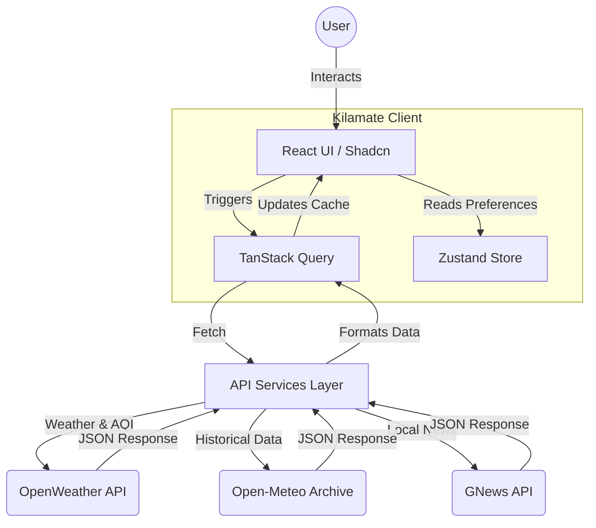

# 🌤️ Kilamate - Advanced Weather & Air Quality App

<div align="center">
  <a href="https://kilamate.netlify.app" target="_blank">
    
  </a>
  <br/><br/>
  
  **A next-generation Weather & Air Quality Forecasting application crafted with React, Vite, TypeScript, and Shadcn UI.**

  <p align="center">
    <a href="https://kilamate.netlify.app" target="_blank">
      
    </a>
    <a href="https://github.com/Zuhaib-dev/Kilamate">
      
    </a>
    <a href="https://www.zuhaibrashid.com/">
      
    </a>
  </p>
</div>

---

## 📌 About Kilamate

**Kilamate** is a modern, high-performance weather forecasting platform developed by **Zuhaib Rashid**. It goes far beyond standard temperature readings to deliver **Real-time Air Quality Index (AQI)** data, historical weather comparisons, Recharts-powered analytics, and highly specialized **Kashmir agricultural insights** for orchard owners and farmers.

Designed with an obsession for user experience, Kilamate features a beautiful glassmorphic interface, dynamic weather-based backgrounds, and lightning-fast performance powered by **Vite** and **TanStack Query**.

---

## 📸 App in Action

*(Replace these placeholders with your actual GIFs!)*

<div align="center">
  
  
  <br/>
  
  
  
  <br/>
  
  
</div>

---

## 🏗️ Architecture & Data Flow

Kilamate uses a robust, modern frontend architecture to deliver real-time data seamlessly.



---

## 🚀 Key Features

### 🌪️ Core Weather & Analytics
- **Live Weather Dashboard:** Highly accurate real-time data for any location globally.
- **Air Quality Index (AQI):** Deep-dive into US AQI scores, localized health warnings, and pollutant breakdowns (PM2.5, CO, NO2).
- **Interactive Recharts:** Visualizes temperature, humidity, and precipitation trends over the coming days.
- **Interactive 3D Globe & Maps:** Explore weather patterns across the globe with `react-globe.gl` and interactive Leaflet maps.
- **History vs. Now:** Compares current weather against 5-year historical averages to identify climate anomalies.
- **AI-Powered "Best Day" Suggester:** Algorithm scores the week's forecast to recommend the best day for outdoor activities.

### 🌐 Global Reach & Accessibility
- **Progressive Web App (PWA):** Installable on any device for a native-like experience and offline capabilities.
- **Multi-language Support:** Seamlessly switch between English, Hindi, Urdu, and more using `i18next`.

### 🍎 Specialized Agriculture Advisor (Kashmir)
- **SKUAST-K Spray Schedule:** Built-in apple phenology tracker providing duration-based spray schedules.
- **Smart Disease Tracking:** Algorithms calculate *Mills Period* conditions to warn orchard owners about **Apple Scab** risk based on live temperature and humidity.
- **Micro-Localized Intelligence:** Bilingual native support translating critical farming insights into Urdu (`ur`) and Hindi (`hi`).

### ✨ Premium UX/UI
- **Live Dynamic Backgrounds:** The app visually reacts to the weather (e.g., raining, snowing, or rendering twinkling stars).
- **Golden Hour & Sun Tracker:** Perfect for photographers, visualizing the sun's arc and exact twilight times.
- **Smart Wind Compass:** An animated SVG compass tracking wind speed against the Beaufort scale.
- **Glassmorphism Design:** A stunning, modern interface built with Tailwind CSS and Shadcn UI components.

---

## 🧪 Tech Stack

| Category | Technology |
|---|---|
| **Core Framework** | React 18, Vite, TypeScript |
| **Styling & UI** | Tailwind CSS, Shadcn UI, Framer Motion |
| **State & Fetching**| TanStack Query (React Query), Zustand |
| **Maps & 3D** | Leaflet, React-Leaflet, React-Globe.gl, Three.js |
| **Visualizations** | Recharts, Lucide React Icons |
| **PWA & i18n** | Vite PWA, Workbox, i18next |
| **Testing** | Vitest, React Testing Library |
| **Data Providers** | OpenWeather API, GNews API, Open-Meteo |

---

## 🚀 Getting Started

### Prerequisites
- **Node.js** 18+ and **npm**
- **OpenWeather API key** ([Get one free here](https://openweathermap.org/api))
- **GNews API key** ([Get one free here](https://gnews.io/))

### Installation

1. **Clone the repository:**
   ```bash
   git clone https://github.com/Zuhaib-dev/Kilamate.git
   cd Kilamate
   ```

2. **Windows Users (Fix Execution Policy):**
   If you encounter a "running scripts is disabled" error, run PowerShell as Administrator:
   ```powershell
   Set-ExecutionPolicy -Scope CurrentUser -ExecutionPolicy RemoteSigned
   ```

3. **Install dependencies:**
   ```bash
   npm install
   ``` 

4. **Environment Variables:**
   Create a `.env` file in the root directory:
   ```bash
   cp .env.example .env
   ```
   Add your API keys to the `.env` file:
   ```env
   VITE_OPENWEATHER_API_KEY=your_openweather_key
   VITE_GNEWS_API_KEY=your_gnews_key
   ```

5. **Start Development Server:**
   ```bash
   npm run dev
   ```
   Open your browser and navigate to `http://localhost:5173`.

---

## 👨‍💻 Meet the Developer

<div align="center">
  <a href="https://www.zuhaibrashid.com/">
    
  </a>
  
  ### Zuhaib Rashid
  **Frontend Web Developer | Class 12 (Medical Stream)**  
  📍 Srinagar, Jammu and Kashmir, India

  *Passionate about building fast, accessible, and beautifully designed web applications. Kilamate is a testament to blending great design with complex data visualization.*
</div>

### 🔗 Connect With Me & View My Portfolio

If you liked Kilamate, check out my other work!

- 🌐 **Portfolio / Website:** [**www.zuhaibrashid.com**](https://www.zuhaibrashid.com/) *(Check out my latest projects!)*
- 💼 **LinkedIn:** [Xuhaib Rashid](https://www.linkedin.com/in/xuhaib-rashid-661345318)  
- 🐙 **GitHub:** [@Zuhaib-dev](https://github.com/Zuhaib-dev/)  
- 🐦 **Twitter / X:** [@xuhaib_x9](https://x.com/xuhaib_x9)  
- 📧 **Email:** [zuhaibrashid01@gmail.com](mailto:zuhaibrashid01@gmail.com)  

---

## 🤝 Contributing

Contributions are always welcome! 

1. Fork the project
2. Create your feature branch (`git checkout -b feature/AmazingFeature`)
3. Commit your changes (`git commit -m 'Add some AmazingFeature'`)
4. Push to the branch (`git push origin feature/AmazingFeature`)
5. Open a Pull Request

---

## 📄 License & Acknowledgements

- This project is licensed under the [MIT License](LICENSE).
- Special thanks to **Sheryians Coding School**.

<div align="center">
  <br/>
  Made with ❤️ by <a href="https://www.zuhaibrashid.com/">Zuhaib Rashid</a>
</div> 